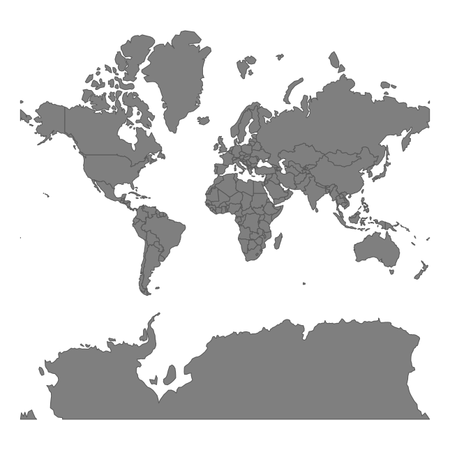

# The distortion of the Mercator projection

<!-- badges: start -->

<!-- badges: end -->

Learn more by reading [the "How much our maps are distorted?" blog post](https://nowosad.github.io/post/maps-distortion/).

